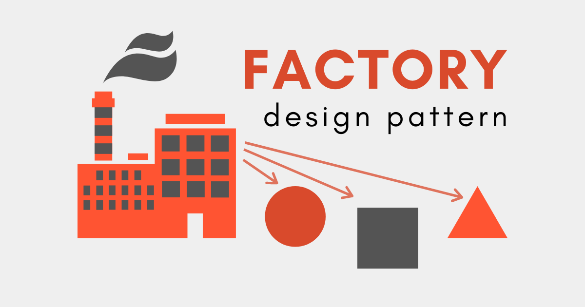

<!-- Improved compatibility of back to top link: See: https://github.com/othneildrew/Best-README-Template/pull/73 -->
<a name="readme-top"></a>
<!--
*** Thanks for checking out the Best-README-Template. If you have a suggestion
*** that would make this better, please fork the repo and create a pull request
*** or simply open an issue with the tag "enhancement".
*** Don't forget to give the project a star!
*** Thanks again! Now go create something AMAZING! :D
-->


<!-- PROJECT SHIELDS -->
<!--
*** I'm using markdown "reference style" links for readability.
*** Reference links are enclosed in brackets [ ] instead of parentheses ( ).
*** See the bottom of this document for the declaration of the reference variables
*** for contributors-url, forks-url, etc. This is an optional, concise syntax you may use.
*** https://www.markdownguide.org/basic-syntax/#reference-style-links
-->
[![Contributors][contributors-shield]][contributors-url]
[![Forks][forks-shield]][forks-url]
[![Stargazers][stars-shield]][stars-url]
[![Issues][issues-shield]][issues-url]
[![MIT License][license-shield]][license-url]
[![LinkedIn][linkedin-shield]][linkedin-url]


<!-- PROJECT LOGO -->
<br />
<div align="center">
  <a href="https://github.com/gregoryfiel/ranking-names-ibge">
    
  </a>

<h3 align="center">Bank System with Factory Pattern</h3>

  <p align="center">
    This project introduces a Bank Terminal utilizing the Factory Pattern. It efficiently manages Silver and Gold accounts, with distinct features for each.
    <br />
    <a href="https://github.com/gregoryfiel/ranking-names-ibge/issues">Report Bug</a>
    ·
    <a href="https://github.com/gregoryfiel/ranking-names-ibge/issues">Request Feature</a>
  </p>
</div>


<!-- TABLE OF CONTENTS -->
<details>
  <summary>Table of Contents</summary>
  <ol>
    <li>
      <a href="#about-the-project">About The Project</a>
      <ul>
        <li><a href="#built-with">Built With</a></li>
      </ul>
    </li>
    <li>
      <a href="#getting-started">Getting Started</a>
      <ul>
        <li><a href="#prerequisites">Prerequisites</a></li>
        <li><a href="#installation">Installation</a></li>
      </ul>
    </li>
    <li><a href="#usage">Usage</a></li>
    <li><a href="#contributing">Contributing</a></li>
    <li><a href="#license">License</a></li>
    <li><a href="#contact">Contact</a></li>
    <li><a href="#acknowledgments">Acknowledgments</a></li>
  </ol>
</details>


<!-- ABOUT THE PROJECT -->
## About The Project

### Built With

* [![Python][Python]][Python-url]
* [![Git][Git]][Git-url]

<p align="right">(<a href="#readme-top">back to top</a>)</p>


<!-- GETTING STARTED -->
## Getting Started

The Factory Pattern is a design pattern that provides an interface for creating objects in a superclass but allows subclasses to alter the type of objects that will be created. In summary, it encapsulates the object creation logic, offering a flexible way to create different instances of a base class.

Explore the Factory Pattern in this Bank Terminal project. The Factory Pattern encapsulates the creation logic, providing an interface (ContaFactory) to create different account instances. The subclasses (ContaSilver and ContaGold) implement specific account creation, allowing flexible and extensible account management.

### Prerequisites
* Python: You can download and install Python from [Python's official website](https://www.python.org/).

* Requirements.txt
```sh
pip install -r requirements.txt
```

### Installation

1. Clone the repo
   ```sh
   git clone https://github.com/gregoryfiel/ranking-names-ibge.git
   ```
2. Run the script:
   ```sh
   python main.py --criar_conta YourName (float)InitialDeposit
   ```


<p align="right">(<a href="#readme-top">back to top</a>)</p>


<!-- USAGE EXAMPLES -->
## Usage

To use this names ranking system, follow these steps:

### 1. Create your account

Start by creating an account and defining an initial deposit. If your deposit is less than R$ 5000.00, your account will be Silver, and you cannot request a loan. If it's more than R$ 5000.00, your account will be Gold, and you are free to request any loan (3% per month).

```bash
  python main.py --criar_conta Gregory 6000
```

### 2. Access your account

After creating your account, you can access it by typing the following command:
```bash
python main.py --acessar_conta Gregory
```

### 3. Withdrawal

To make a withdrawal, you can type the following command, specifying the desired amount:

```bash
python main.py --saque Gregory 200
```

### 4. Deposit

To make a deposit, you can type the following command, specifying the desired amount:
```bash
python main.py --deposito Gregory 350
```

### 5. Loan

To request a loan, type the following command, specifying the desired amount. Note that your account needs to be Gold, and a new attribute will appear, indicating your current debt.
```bash
python main.py --emprestimo Gregory 20000
```

### 5. Next month

To calculate the debt for the next month, you can use the following command:
```bash
python main.py --proximo_mes Gregory
```

### At each step, a printout will appear in your terminal displaying the following information:

Example:
```
--------------------------------------------------------------------------------
Conta: gregory | Número 5654 | Saldo: R$ 10000.00 | Dívida: R$ 0.00 | Conta Gold
--------------------------------------------------------------------------------
```
<p align="right">(<a href="#readme-top">back to top</a>)</p>

<!-- CONTRIBUTING -->
## Contributing

Contributions are what make the open source community such an amazing place to learn, inspire, and create. Any contributions you make are **greatly appreciated**.

If you have a suggestion that would make this better, please fork the repo and create a pull request. You can also simply open an issue with the tag "enhancement".
Don't forget to give the project a star! Thanks again!

1. Fork the Project
2. Create your Feature Branch (`git checkout -b feature/AmazingFeature`)
3. Commit your Changes (`git commit -m 'Add some AmazingFeature'`)
4. Push to the Branch (`git push origin feature/AmazingFeature`)
5. Open a Pull Request

<p align="right">(<a href="#readme-top">back to top</a>)</p>


<!-- LICENSE -->
## License

Distributed under the MIT License. See `LICENSE.txt` for more information.

<p align="right">(<a href="#readme-top">back to top</a>)</p>


<!-- CONTACT -->
## Contact

Gregory - [@twitter_handle](https://twitter.com/gregoryfiel)

Project Link: [https://github.com/gregoryfiel/ranking-names-IBGE](https://github.com/gregoryfiel/ranking-names-ibge)

<p align="right">(<a href="#readme-top">back to top</a>)</p>


<!-- ACKNOWLEDGMENTS -->
## Acknowledgments

* Thanks to Ilegra for providing this opportunity to learn by doing.
* Special mention to the Clean Code principles for code maintainability.

<p align="right">(<a href="#readme-top">back to top</a>)</p>


<!-- MARKDOWN LINKS & IMAGES -->
<!-- https://www.markdownguide.org/basic-syntax/#reference-style-links -->
[contributors-shield]: https://img.shields.io/github/contributors/gregoryfiel/ranking-names-ibge.svg?style=for-the-badge
[contributors-url]: https://github.com/gregoryfiel/ranking-names-ibge/graphs/contributors
[forks-shield]: https://img.shields.io/github/forks/gregoryfiel/ranking-names-ibge.svg?style=for-the-badge
[forks-url]: https://github.com/gregoryfiel/ranking-names-ibge/network/members
[stars-shield]: https://img.shields.io/github/stars/gregoryfiel/ranking-names-ibge.svg?style=for-the-badge
[stars-url]: https://github.com/gregoryfiel/ranking-names-ibge/stargazers
[issues-shield]: https://img.shields.io/github/issues/gregoryfiel/ranking-names-ibge.svg?style=for-the-badge
[issues-url]: https://github.com/gregoryfiel/ranking-names-ibge/issues
[license-shield]: https://img.shields.io/github/license/gregoryfiel/ranking-names-ibge.svg?style=for-the-badge
[license-url]: https://github.com/gregoryfiel/ranking-names-ibge/blob/main/LICENSE
[linkedin-shield]: https://img.shields.io/badge/-LinkedIn-black.svg?style=for-the-badge&logo=linkedin&colorB=555
[linkedin-url]: https://www.linkedin.com/in/gregory-fiel
[product-screenshot]: images/capture.png
[Python]:https://img.shields.io/badge/python-3670A0?style=for-the-badge&logo=python&logoColor=ffdd54
[Python-url]:https://www.python.org/
[Redis]: https://img.shields.io/badge/redis-%23DD0031.svg?style=for-the-badge&logo=redis&logoColor=white
[Redis-url]: https://redis.io/
[Git]: https://img.shields.io/badge/git-%23F05033.svg?style=for-the-badge&logo=git&logoColor=white
[Git-url]: https://git-scm.com/

